# 📸 iTaiwan-Hotspot-Manager 系統截圖總覽

歡迎來到系統展示相簿！這裡完整紀錄了本專案的實際操作畫面與功能細節。

## 1. 🔐 身份驗證 (Authentication)
支援帳號與 Email 登入，並具備完整的註冊驗證流程。

| 登入介面 (一般) | 支援 Email 登入 |
|:---:|:---:|
| 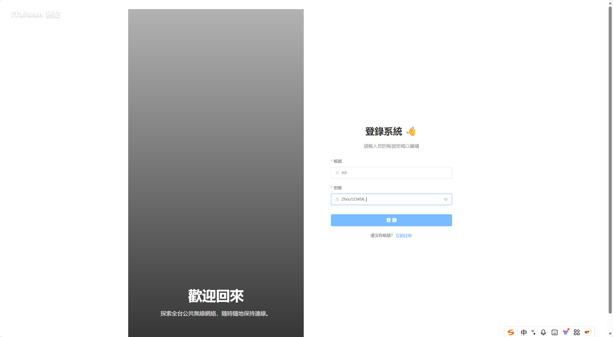 | 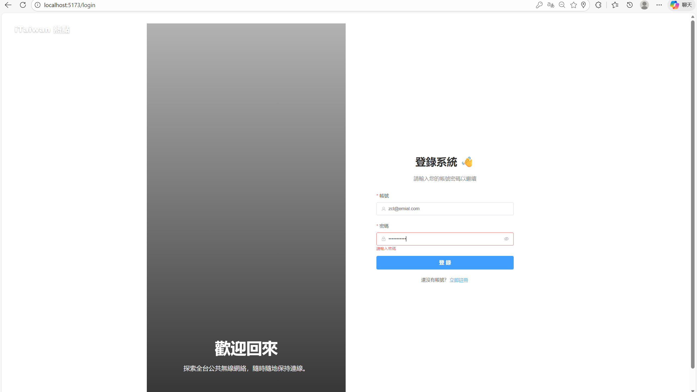 |

| 註冊成功 | 註冊失敗 (錯誤驗證) |
|:---:|:---:|
| 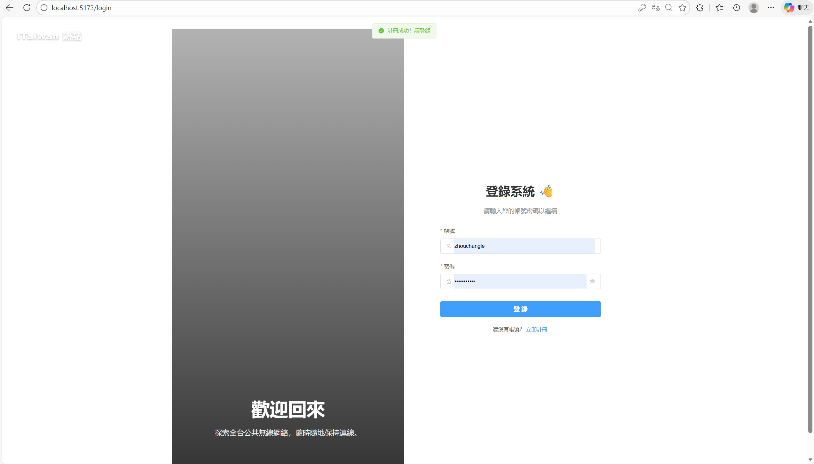 | 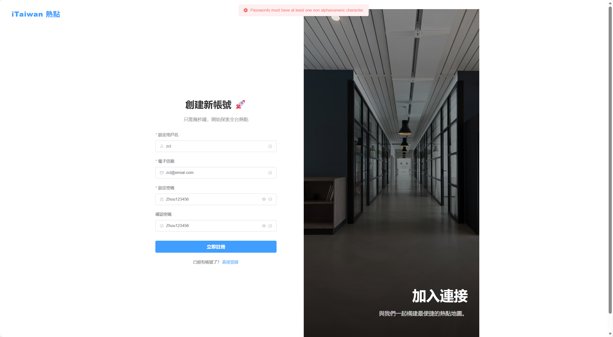 |

---

## 2. 🗺️ 熱點地圖與列表 (Map & List Mode)
提供視覺化地圖模式與高效的分頁列表模式，方便使用者查找熱點。

### 地圖模式
整合 Google Maps，支援縮放與聚落顯示。

| 預設視角 | 縮放檢視 |
|:---:|:---:|
| 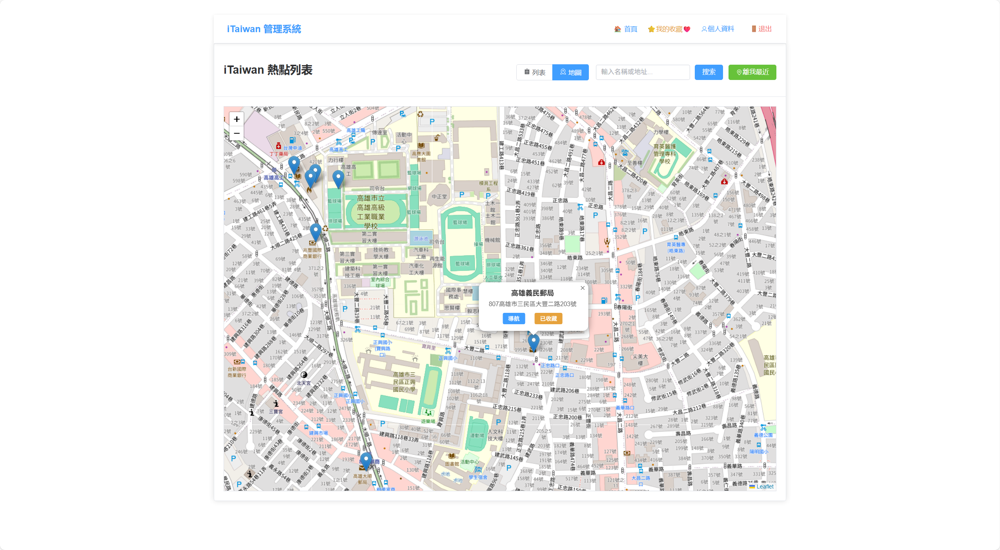 | 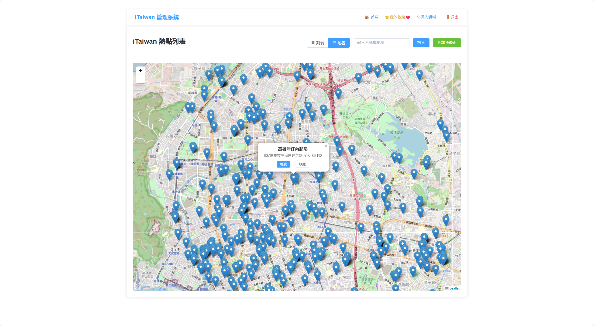 |

### 列表模式
| 分頁列表展示 |
|:---:|
| 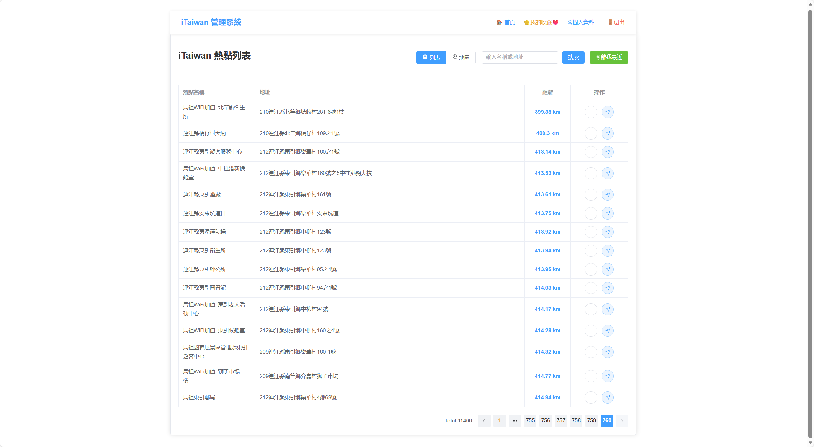 |
> 支援伺服器端分頁，確保大量數據下的效能表現。

---

## 3. 🔍 搜尋與排序 (Search & Sort)
強大的篩選功能，快速定位目標熱點。

| 關鍵字搜尋 | 按距離排序 |
|:---:|:---:|
| 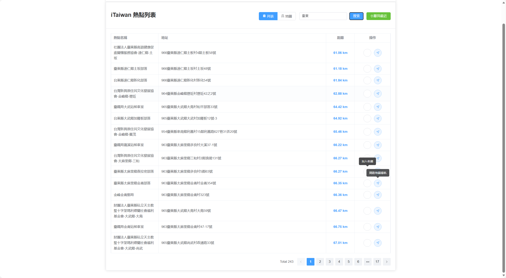 | 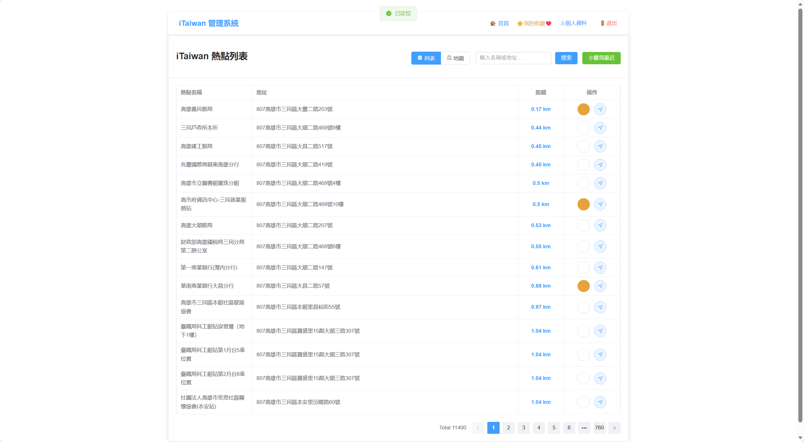 |
> (左) 根據區域名稱或地址搜尋；(右) 依據使用者當前位置計算距離並排序。

---

## 4. ❤️ 收藏功能 (Favorites)
將常用的熱點加入清單，並可自定義備註。

| 加入收藏 | 編輯收藏備註 |
|:---:|:---:|
| 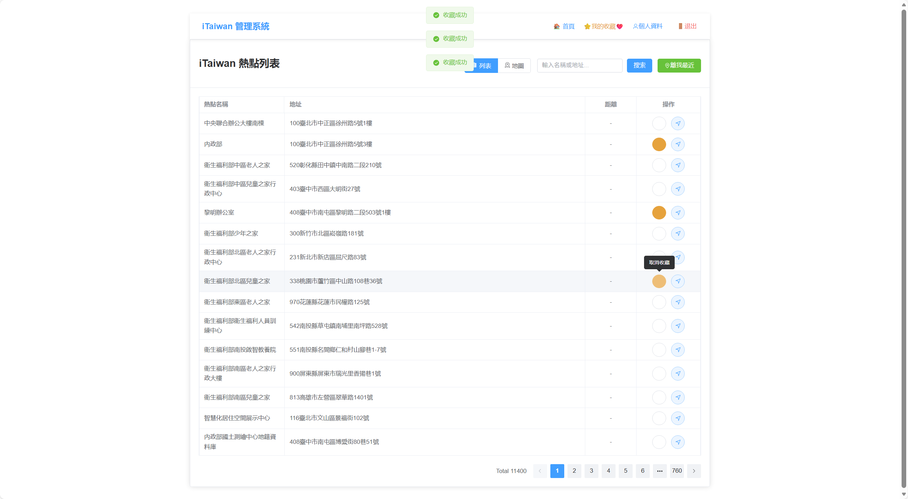 | 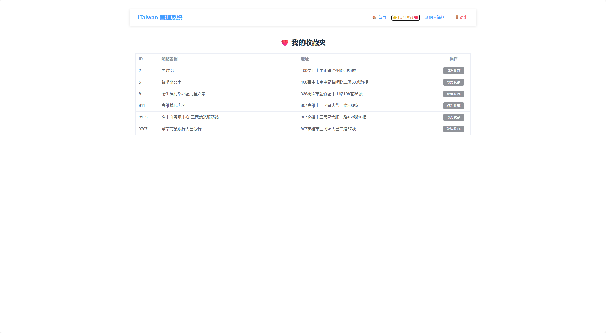 |

---

## 5. 👤 個人中心 (User Profile)
完整的個人資料管理系統，支援即時預覽與更新。

### 資料修改
| 編輯個人資料 | 修改成功提示 |
|:---:|:---:|
| 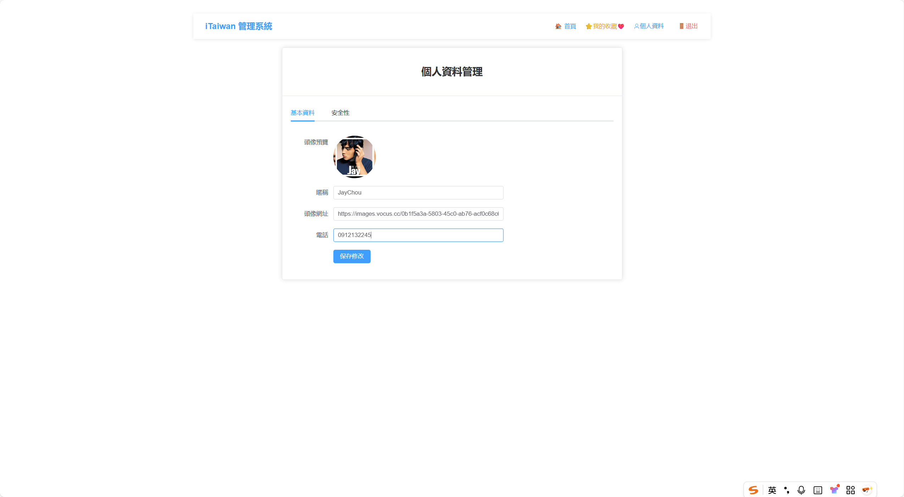 | 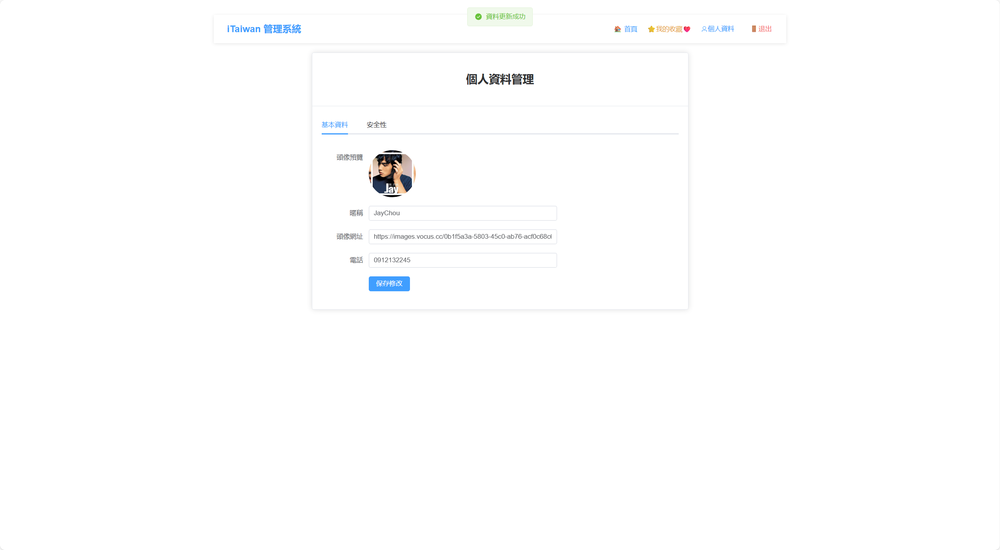 |

### 安全性設定
| 修改密碼 |
|:---:|
| 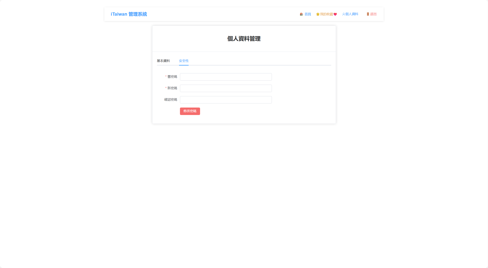 |

---

[🔙 返回專案首頁](../README.md)
